Invoice versión 3, es la aplicación que se está realizando de manera modular para el estudio de todo el temario de la asignatura ✨DEINT.✨

 ## Historial de versiones

 ### V3.7.2 (14/01/2024)
 *Escrito por SergioGV98*
 - Se han incorporado ajustes en la configuración de tareas, permitiendo a los usuarios ordenar la información según la ID, el nombre del cliente (tanto de manera ascendente como descendente) y por nombre de la tarea.
- -------------------------
  ### V3.7.1 (13/01/2024)
 *Escrito por CBO121311*
 - Añadido las preferencias los tipos de orden de los módulos y los tamaños textos del dashborad
 - Se ha dado funcionalidad el ordenar de customer y los del texto.
 - Todos las enumeraciones se han añadido en una carpeta
- ------------------------
 ### V3.7.0 (13/01/2024)
 *Escrito por SergioGV98*
 - Los iconos de las tarjetas han sido eliminados y reemplazados por un menú accesible mediante pulsación larga.
 - Ahora, al visualizar la información de una tarea, se incluye la indicación 'Vencida' si la fecha de finalización ha pasado.
- ------------------------
 ### V3.6.9 (13/01/2024)
 *Escrito por SergioGV98*
 - Se ha eliminado el FAB (Floating Action Button) de creación de tarea y se ha utilizado el de la aplicación general.
 - Se han corregido varios errores relacionados con la carga de la lista de tareas.
- ------------------------
### V3.6.8 (11/01/2024)
 *Escrito por CBO121311*
 - Añadido las preferencias.
 - Se ha cambiado el fondo del tasklist a uno que más corresponde a la aplicación.
 - Se cambió la forma de subir la foto del customer.
 - Corregido el error del ColorSecondary del tema de la aplicación, que no corresponde con el que era.
 - Arreglado pequeños detalles en el módulo customer
- ------------------------
 ### V3.6.7 (05/01/2024)
 *Escrito por mateotamayoo*
 - Se eliminan los Floating Actions Buttons para usar el de la actividad principal
 - Añadida pantalla de carga en la lista de facturas
 - Añadido botón de borrado de artículo en la creación de factura
 - Cambio de ubicación de los botones de editar y borrar al menú de detalles
 - Edición de factura habilitada
 - Data class Factura cambia sus miembros, se utiliza un objeto de la clase customer en vez del id del customer
 - Cambio en los items del recycler view de Invoice List, se añade el estado de la factura
 - Se ordena en Invoice List por el nombre del cliente
 - Se añade animación en la interfaz de Invoice List
- ------------------------
 ### V3.6.3 (31/12/2023)
 *Escrito por SergioGV98*
 - Se han incorporado botones en el menú de la lista de tareas para refrescar y ordenar la lista.
 - Se ha introducido una pantalla de carga al cargar la lista de tareas.
 - Se ha actualizado la lógica de manejo de clientes; ahora se utiliza el tipo Customer en lugar de representarlos como enteros.
 - Se han realizado diversos ajustes y correcciones en varias partes del código para mejorar la calidad y la legibilidad.
- ------------------------  
 ### V3.6.1 (24/12/2023)
 *Escrito por CBO121311*
 - Añadido prefijo al customer creation.
 - Y POR FIN, arreglé el error en que el teclado del móvil tapaba los textinputlayout.
- ------------------------
 ### V3.6.0 (24/12/2023)
 *Escrito por CBO121311*
 - Añadido el botón flotante en el mainActivity para que se modifique su utilización en los distintos fragments.
 - Actualización leve del Dashboard
 - De Customer:
     - Aparece un Popup Menu al hacer pulsación larga en la lista customer.
     - Implementado edición en el detail.
     - Añadido o modificado los comentarios de las funciones de customer.
     - Internacionalizado los String de Customer y los del App.
     - Modificaciones leves en el diseño de las layout.
  - ------------------------
 ### V3.5.4 (20/12/2023)
 *Escrito por CBO121311*
 - Las fotos de la galería ya lo puede obtener como dato el propio repositorio. Para ello se ha tenido que modificar levemente alguno de los otros módulos para que siguiese funcionando.
 - Eliminar ya se hace con una pulsación larga.
 - Limpieza de código.
 - ------------------------
 ### V3.5.3 (16/12/2023)
 *Escrito por CBO121311*
 - Arreglado el error de que si el nombre o email del customer está en blanco no tenía el estado Empty.
 - El botón Registro (SignUp) ya funciona.
 - Limpieza de comentarios en el módulo account.
 - ------------------------
 ### V3.5.2 (15/12/2023)
 *Escrito por CBO121311*
 - Si retrocedes usando el toolbar desde el propio dashboard ya no te lleva al fragment_splash. Pone la aplicación en segundo plano.
 - Actualizado la barra de toolbar del customer y el orden del repositorio.
 - ------------------------
 ### V3.5.1 (14/12/2023)
 *Escrito por SergioGV98*
 - Implementación de la función editar una tarea.
 - Nueva forma de mostrar el error de la fecha.
 - Eliminación de código innecesario y limpieza de la interfaz.
------------------------
 ### V3.5.0 (07/12/2023)
 *Escrito por CBO121311*
 - Últimos retoques.
------------------------
 ### V3.4.7 (04/12/2023)
 *Escrito por CBO121311*
 - Añadida layout Acerca de
 - Añadido progressbar al customer
 - Implementado de forma correcta la excepción ReferencedCustomer e InvalidId a través del viewModel
 - Los capa view de customer se han adaptado para que no contacte de forma directa con el repositorio.
------------------------
 ### V3.4.1 (01/12/2023)
 *Escrito por CBO121311*
 - Añadido animación al splash y customList.
 - Ahora Email es un tipo de dato.
 - El botón editar de customer funciona.
 - Añadido excepción referenciado.
 - Diversos cambios de código, de databinding y unido viewholder.
------------------------
### V3.4.0 (30/11/2023)
 *Escrito por SergioGV98*
 - Mejores visuales en la interfaz de creación de tareas.
 - Se ha implementado una excepción que evita que puedas crear una tarea si la fecha de finalización
de la misma es anterior a la de la creación.
------------------------
### V3.3.95 (30/11/2023)
 *Escrito por SergioGV98*
 - Arreglos al mostrar las listas; la descripción ya no se expande.
 - Se implementó la función de mostrar la fecha de creación y finalización de una tarea con Instant.
------------------------
## V3.3.9 (29/11/2023)
 *Escrito por SergioGV98*
 - Se ha implementado la visualización de imágenes en la lista de tareas según las preferencias del cliente que las haya creado.
------------------------
### V3.3.8 (29/11/2023)
 *Escrito por SergioGV98*
 - Se ha mejorado la interfaz de creación de tareas para que sea más intuitiva.
 - Se ha implementado una excepción para manejar la falta de asignación de un cliente en una tarea.
------------------------
 ### V3.3.7 (28/11/2023)
 *Escrito por SergioGV98*
 - Se ha añadido la funcionalidad de AlertBox para eliminar tareas.
------------------------
 ### V3.3.6 (28/11/2023)
 *Escrito por SergioGV98*
 - Se ha mejorado la interfaz de creación de tareas al reemplazar el campo de entrada de texto para el cliente con un menú desplegable que ahora muestra la lista de clientes disponibles.
------------------------
 ### V3.3.5 (28/11/2023)
 *Escrito por SergioGV98*
 - Se ha implementado una excepción para manejar la falta de asignación de un nombre a una tarea.
 - Realizados cambios visuales en la interfaz de la Lista de tareas.
 - Mejoras generales en la creación de tareas.
------------------------
 ### V3.3.4 (28/11/2023)
 *Escrito por SergioGV98*
 - Implementada la funcionalidad para que al añadir una tarea, esta se refleje automáticamente en la lista de tareas.
 - Se han incorporado funciones para obtener el estado y el tipo de una tarea de manera eficiente.
 - Ahora la información de la tarea correspondiente se visualiza de forma consistente en todas las interfaces.
 - Se ha eliminado código innecesario, mejorando la legibilidad y eficiencia del programa.
------------------------
 ### V3.3.3 (27/11/2023)
 *Escrito por SergioGV98*
 - Implementado que al tener la lista vacía en taskList sale una imagen avisándote.
 - TaskList es ahora un MutableList de vez de una lista.
 - Implementado que al seleccionar un elemento de lista de tareas muestre su información en la capa detalles utilizando SafeArgs.
------------------------
 ## V3.3.0 (26/11/2023)
 *Escrito por CBO121311*
 - El toolbar se ha cambiado de color (cambio temporal)
 - Iconos más grande en el dashboard.
 - Rediseño de las capas de customer, los colores se han cambiado para que se parezca más al tema seleccionado.
 - Implementado borrar un cliente en el CustomerDetail y su mensaje de confirmación.
 - Implementado añadir un cliente y varias excepciones en el CustomerCreation *(Nombre vacío, Email vacío, Formato email incorrecto).*
 - Implementado que al tener la lista vacía en customerList sale una imagen avisándote.
 - CustomerProvider es ahora un MutableList de vez de una lista.
------------------------
 ### V3.2.2 (22/11/2023)
 *Escrito por CBO121311*
 - Implementado que al seleccionar un elemento de lista de clientes muestre su información en la capa detalles utilizando SafeArgs.
 - Preparando el proyecto para meter las entidades y los datos en el domain. Las de clientes y user ya se han añadido.
 - Cambiado el nombre *invoice* por *invoiceDomain* y la de *invoicemodule* por *invoice*.
------------------------
 ### V3.2.1 (21/11/2023)
 *Escrito por SergioGV98*
 - Actualizado nav-graph usando include-dynamic en task.
------------------------
 ### V3.2.0 (20/11/2023)
 *Escrito por CBO121311*
 - Añadido botón desconectar y su función.
 - Apuntes de Lourdes desorganizado.
 - Actualizado nav-graph usando include-dynamic en customer.
------------------------
 ### V3.1.5 (19/11/2023)
 *Escrito por mateotamayoo*
 - Añadidos artículos a los correspondientes RecyclerViews de las interfaces invoice
 - Añadidos botones de edición y borrado en las interfaces invoice detail y list
 - Añadida funcionalidad para borrar factura desde la interfaz invoice list
 - Cambios en el navgraph para que las interfaces invoice creation y detail vuelvan a list con botones
------------------------
 ### V3.1.3 (19/11/2023)
 *Escrito por SergioGV98*
 - Actualización completa en todas las interfaces de tareas.
 - Añadidas animaciones entre pestañas.
 - Añadida funcionalidad para poder eliminar del listado tareas creadas.
 - Eliminación de recursos, carpetas, líneas innecesarias.
------------------------
 ### V3.1.0 (16/11/2023)
 *Escrito por CBO121311*
 - Actualización completa del dashboard
 - Cambiada la imagen del layout splash.
 - Actualización de los tres layout customer y realizadas con guías.
 - Añadido funcionalidad de borrar a customerlist. También está la función añadir pero está anulado.
 - Corregido bucle del navgraph.
------------------------
 ### V3.0.2 (14/11/2023)
 *Escrito por mateotamayoo*
 - Interfaces de invoice detail e invoice list actualizadas.
 - Cambios en el navgraph para habilitar la navegación entre las interfaces invoice.
------------------------
 ### V3.0.1 (13/11/2023)
 *Escrito por CBO121311*
 - Se ha eliminado los navgraph y los botones relacionado a creation y detail.
 - Comunicación de graph entre las capas de customer.
 - Añadido e implementado nuevo icono

 

 

## Características generales
- Se ha hecho el nav-graph utilizando include-dynamic y cada navegación funciona de forma independiente.
- Añadir y eliminar son funcionables. En Customer funciona el Editar.
- Control de distintas excepciones utilizando el viewModel
- Módelo más parecido a MVVM
- Añadido Splash y about.

# Logo

# Capas de Layout

## Customer
|Creation|Creation: Edit Version|Detail|List|
| ------------------------------ | ------------------------------ | ------------------------------ | ------------------------------ |
|||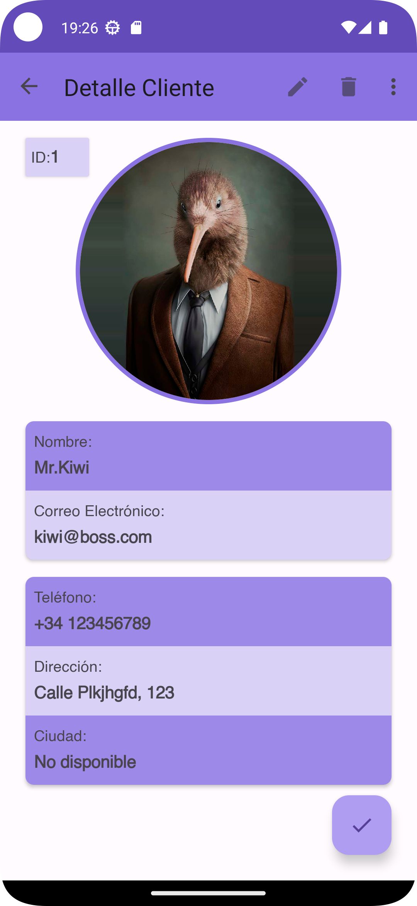| 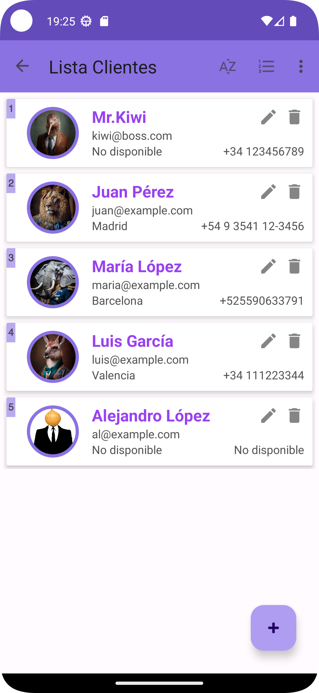|| |

## Item
|Creation|Detail|List| 
| ------------------------------ | ------------------------------ | ------------------------------ | 
|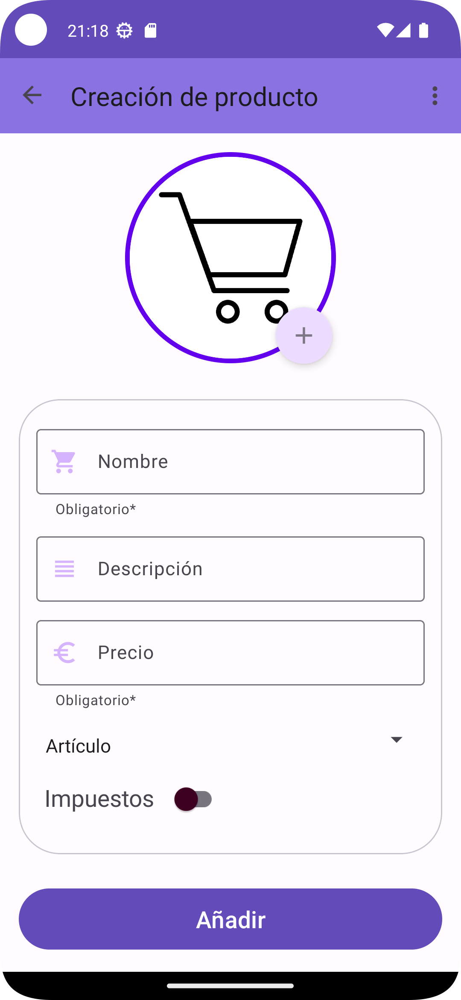|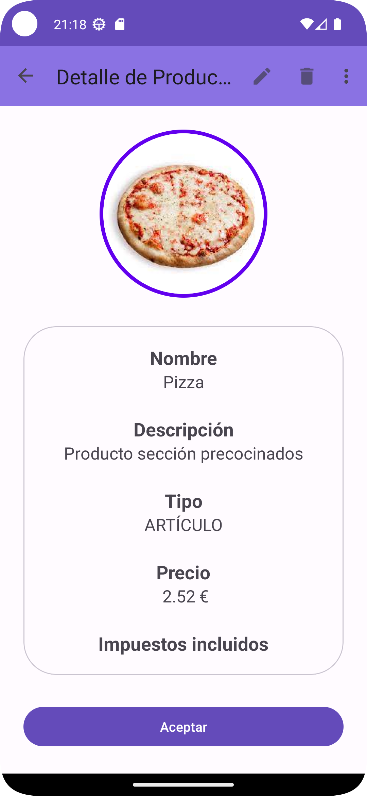| 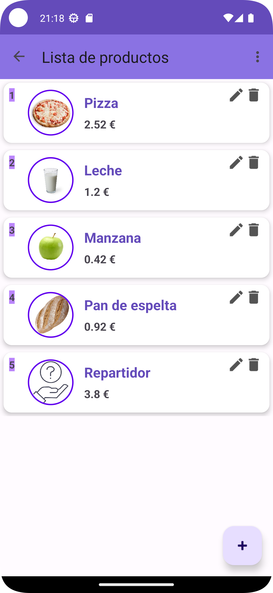|

## Task
|Creation|Detail|List| 
| ------------------------------ | ------------------------------ | ------------------------------ | 
|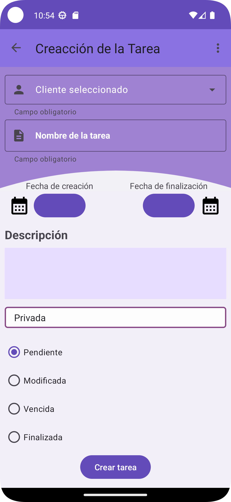|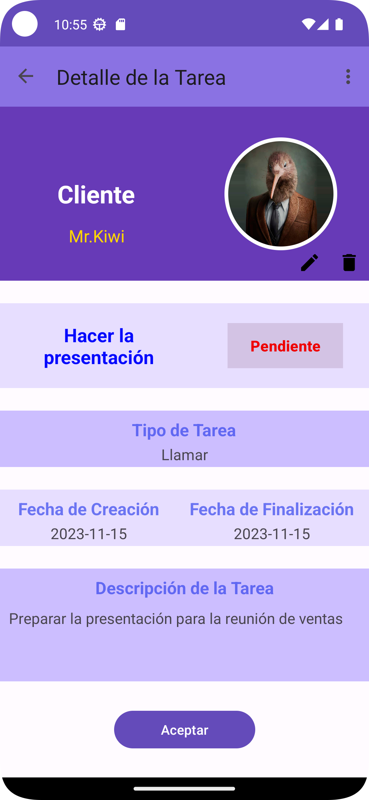| 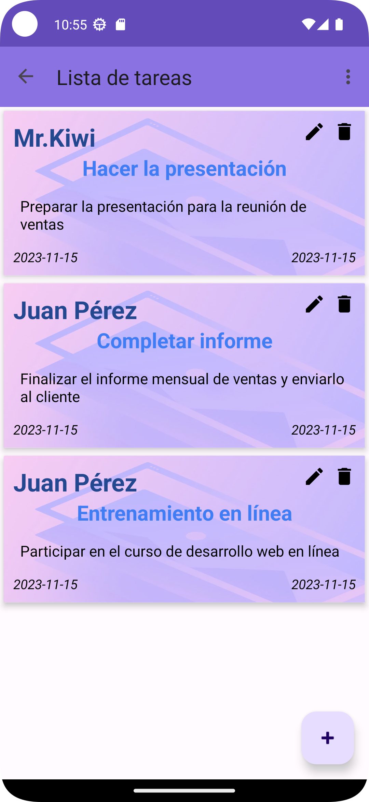|

## Invoice
|Creation|Detail|List| 
| ------------------------------ | ------------------------------ | ------------------------------ | 
|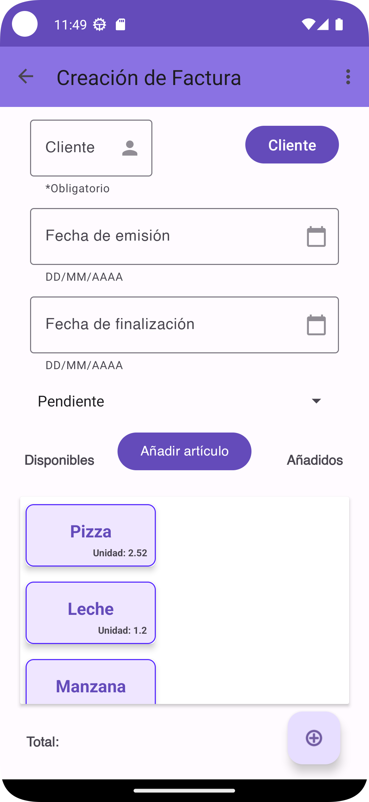|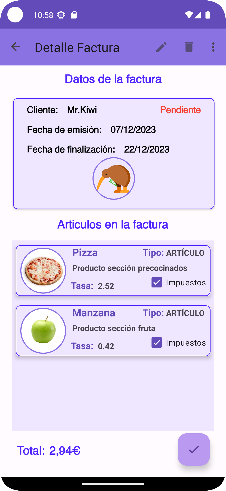| 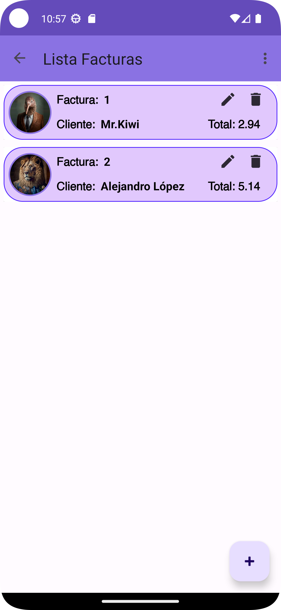|

## Extra
|Dashboard|About|
| ------------------------------ | ------------------------------ |
|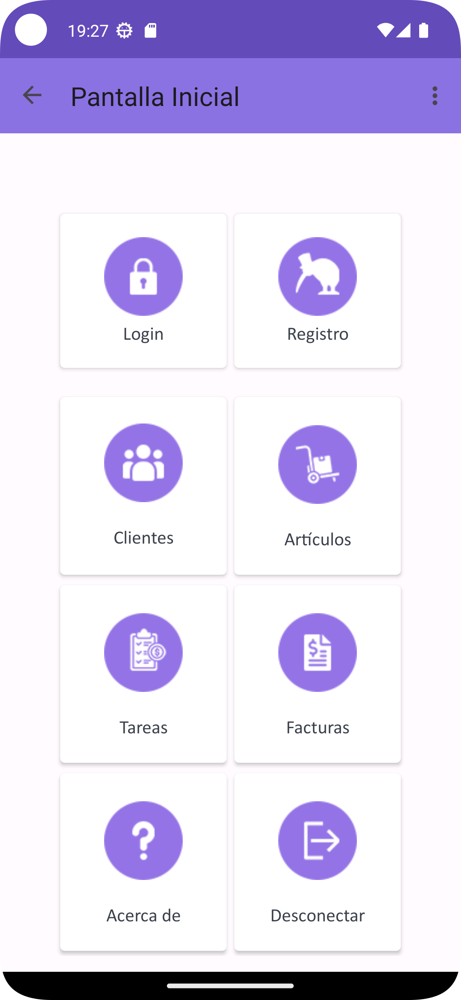|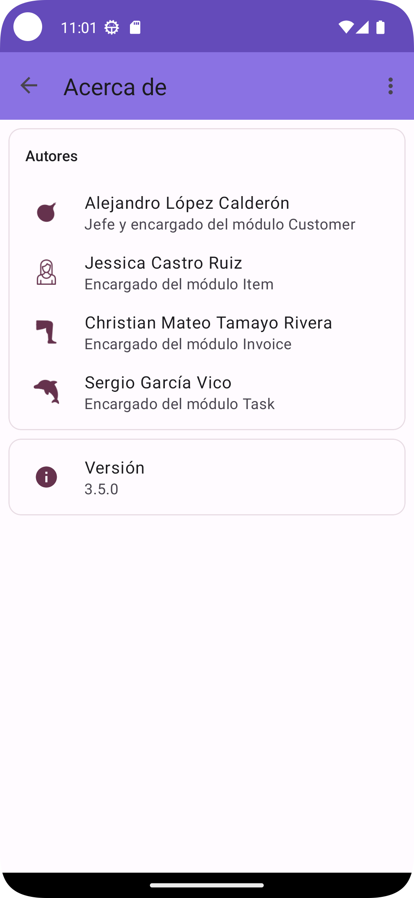|

