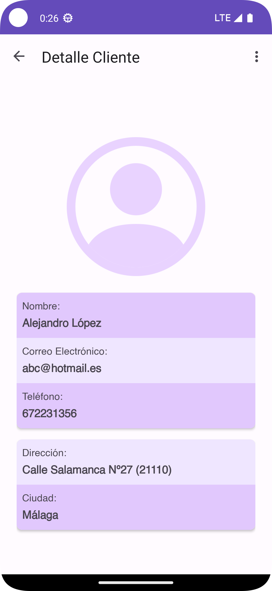

Inovice es la aplicación que se realizará de manera modular para el estudio de todo el temario de ✨DEINT.✨

## Características

- Aplicación que se ha desarrollado con módulos dinámicos
- Nevagación a Fragment de forma directo

 ## V3.0.1 (13/11/2023)
 *Escrito por CBO121311*
 - Se ha eliminado los navgraph y los botones relacionado a creation y detail.
 - Comunicación de graph entre las capas de customer.
 - Añadido e implementado nuevo icono
------------------------
 ## V3.0.2 (14/11/2023)
 *Escrito por mateotamayoo*
 - Interfaces de invoice detail e invoice list actualizadas.
 - Cambios en el navgraph para habilitar la navegación entre las interfaces invoice.
------------------------
 ## V3.1.0 (16/11/2023)
 *Escrito por CBO121311*
 - Actualización completa del dashboard
 - Cambiada la imagen del layout splash.
 - Actualización de los tres layout customer y realizadas con guías.
 - Añadido funcionalidad de borrar a customerlist. También está la función añadir pero está anulado.
 - Corregido bucle del navgraph.
------------------------
 ## V3.1.3 (19/11/2023)
 *Escrito por SergioGV98*
 - Actualización completa en todas las interfaces de tareas.
 - Añadidas animaciones entre pestañas.
 - Añadida funcionalidad para poder eliminar del listado tareas creadas.
 - Eliminación de recursos, carpetas, líneas innecesarias.
------------------------
 ## V3.1.5 (19/11/2023)
 *Escrito por mateotamayoo*
 - Añadidos artículos a los correspondientes RecyclerViews de las interfaces invoice
 - Añadidos botones de edición y borrado en las interfaces invoice detail y list
 - Añadida funcionalidad para borrar factura desde la interfaz invoice list
 - Cambios en el navgraph para que las interfaces invoice creation y detail vuelvan a list con botones
------------------------
 ## V3.2.0 (20/11/2023)
 *Escrito por CBO121311*
 - Añadido botón desconectar y su función.
 - Apuntes de Lourdes desorganizado.
 - Actualizado nav-graph usando include-dynamic en customer.
------------------------
 ## V3.2.1 (21/11/2023)
 *Escrito por SergioGV98*
 - Actualizado nav-graph usando include-dynamic en task.
   
------------------------
 ## V3.2.2 (22/11/2023)
 *Escrito por CBO121311*
 - Implementado que al seleccionar un elemento de lista de clientes muestre su información en la capa detalles utilizando SafeArgs.
 - Preparando el proyecto para meter las entidades y los datos en el domain. Las de clientes y user ya se han añadido.
 - Cambiado el nombre *invoice* por *invoiceDomain* y la de *invoicemodule* por *invoice*.
------------------------
 ## V3.3.0 (26/11/2023)
 *Escrito por CBO121311*
 - El toolbar se ha cambiado de color (cambio temporal)
 - Iconos más grande en el dashboard.
 - Rediseño de las capas de customer, los colores se han cambiado para que se parezca más al tema seleccionado.
 - Implementado borrar un cliente en el CustomerDetail y su mensaje de confirmación.
 - Implementado añadir un cliente y varias excepciones en el CustomerCreation *(Nombre vacío, Email vacío, Formato email incorrecto).*
 - Implementado que al tener la lista vacía en customerList sale una imagen avisándote.
 - CustomerProvider es ahora un MutableList de vez de una lista.
------------------------
 ## V3.3.3 (27/11/2023)
 *Escrito por SergioGV98*
 - Implementado que al tener la lista vacía en taskList sale una imagen avisándote.
 - TaskList es ahora un MutableList de vez de una lista.
 - Implementado que al seleccionar un elemento de lista de tareas muestre su información en la capa detalles utilizando SafeArgs.
------------------------
 ## V3.3.4 (28/11/2023)
 *Escrito por SergioGV98*
 - Implementada la funcionalidad para que al añadir una tarea, esta se refleje automáticamente en la lista de tareas.
 - Se han incorporado funciones para obtener el estado y el tipo de una tarea de manera eficiente.
 - Ahora la información de la tarea correspondiente se visualiza de forma consistente en todas las interfaces.
 - Se ha eliminado código innecesario, mejorando la legibilidad y eficiencia del programa.
------------------------
 ## V3.3.5 (28/11/2023)
 *Escrito por SergioGV98*
 - Se ha implementado una excepción para manejar la falta de asignación de un nombre a una tarea.
 - Realizados cambios visuales en la interfaz de la Lista de tareas.
 - Mejoras generales en la creación de tareas.
------------------------
 ## V3.3.6 (28/11/2023)
 *Escrito por SergioGV98*
 - Se ha mejorado la interfaz de creación de tareas al reemplazar el campo de entrada de texto para el cliente con un menú desplegable que ahora muestra la lista de clientes disponibles.
------------------------
 ## V3.3.7 (28/11/2023)
 *Escrito por SergioGV98*
 - Se ha añadido la funcionalidad de AlertBox para eliminar tareas.
------------------------
 ## V3.3.8 (29/11/2023)
 *Escrito por SergioGV98*
 - Se ha mejorado la interfaz de creación de tareas para que sea más intuitiva.
 - Se ha implementado una excepción para manejar la falta de asignación de un cliente en una tarea.
------------------------
## V3.3.9 (29/11/2023)
 *Escrito por SergioGV98*
 - Se ha implementado la visualización de imágenes en la lista de tareas según las preferencias del cliente que las haya creado.
------------------------
## V3.3.95 (30/11/2023)
 *Escrito por SergioGV98*
 - Arreglos al mostrar las listas; la descripción ya no se expande.
 - Se implementó la función de mostrar la fecha de creación y finalización de una tarea con Instant.
------------------------
## V3.4.0 (30/11/2023)
 *Escrito por SergioGV98*
 - Mejores visuales en la interfaz de creación de tareas.
 - Se ha implementado una excepción que evita que puedas crear una tarea si la fecha de finalización
de la misma es anterior a la de la creación.
------------------------
 ## V3.4.1 (26/11/2023)
 *Escrito por CBO121311*
 - Añadido animación al splash y customList.
 - Ahora Email es un tipo de dato.
 - El botón editar de customer funciona.
 - Añadido excepción referenciado.
 - Diversos cambios de código, de databinding y unido viewholder.

# Icono

# Capas de Layout

## Cliente
|Crear|Detalles|Lista| 
| ------------------------------ | ------------------------------ | ------------------------------ | 
||| |

## Factura
|Crear|Detalles|Lista| 
| ------------------------------ | ------------------------------ | ------------------------------ | 
||| |

## Artículos
|Crear|Detalles|Lista| 
| ------------------------------ | ------------------------------ | ------------------------------ | 
||| |
## Tareas
|Crear|Detalles|Lista| 
| ------------------------------ | ------------------------------ | ------------------------------ | 
||| |
