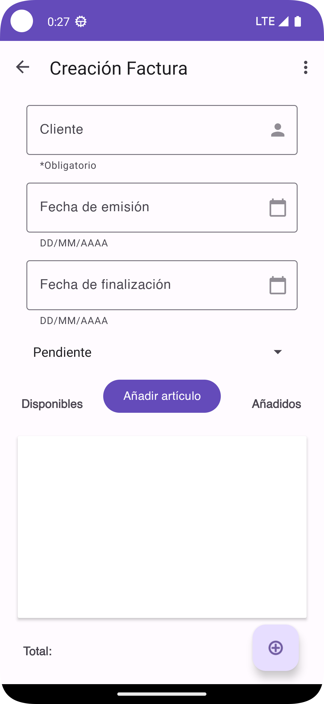
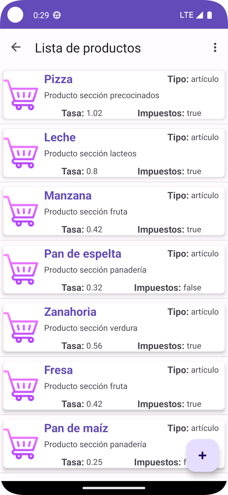

Inovice es la aplicación que se realizará de manera modular para el estudio de todo el temario de ✨DEINT.✨

## Características

- Aplicación que se ha desarrollado con módulos dinámicos
- Nevagación a Fragment de forma directo

 ## V3.0.1 (13/11/2023)
 *Escrito por CBO121311*
 - Se ha eliminado los navgraph y los botones relacionado a creation y detail.
 - Comunicación de graph entre las capas de customer.
 - Añadido e implementado nuevo icono
------------------------
 ## V3.0.2 (14/11/2023)
 *Escrito por mateotamayoo*
 - Interfaces de invoice detail e invoice list actualizadas.
 - Cambios en el navgraph para habilitar la navegación entre las interfaces invoice.
------------------------
 ## V3.1.0 (16/11/2023)
 *Escrito por CBO121311*
 - Actualización completa del dashboard
 - Cambiada la imagen del layout splash.
 - Actualización de los tres layout customer y realizadas con guías.
 - Añadido funcionalidad de borrar a customerlist. También está la función añadir pero está anulado.
 - Corregido bucle del navgraph.
------------------------
 ## V3.1.3 (19/11/2023)
 *Escrito por SergioGV98*
 - Actualización completa en todas las interfaces de tareas.
 - Añadidas animaciones entre pestañas.
 - Añadida funcionalidad para poder eliminar del listado tareas creadas.
 - Eliminación de recursos, carpetas, líneas innecesarias.
------------------------
 ## V3.1.5 (19/11/2023)
 *Escrito por mateotamayoo*
 - Añadidos artículos a los correspondientes RecyclerViews de las interfaces invoice
 - Añadidos botones de edición y borrado en las interfaces invoice detail y list
 - Añadida funcionalidad para borrar factura desde la interfaz invoice list
 - Cambios en el navgraph para que las interfaces invoice creation y detail vuelvan a list con botones
------------------------
 ## V3.2.0 (20/11/2023)
 *Escrito por CBO121311*
 - Añadido botón desconectar y su función.
 - Apuntes de Lourdes desorganizado.
 - Actualizado nav-graph usando include-dynamic en customer.
------------------------
 ## V3.2.1 (21/11/2023)
 *Escrito por SergioGV98*
 - Actualizado nav-graph usando include-dynamic en task.
   
------------------------
 ## V3.2.2 (22/11/2023)
 *Escrito por CBO121311*
 - Implementado que al seleccionar un elemento de lista de clientes muestre su información en la capa detalles utilizando SafeArgs.
 - Preparando el proyecto para meter las entidades y los datos en el domain. Las de clientes y user ya se han añadido.
 - Cambiado el nombre *invoice* por *invoiceDomain* y la de *invoicemodule* por *invoice*.

# Icono

# Capas de Layout

## Cliente
|Crear|Detalles|Lista| 
| ------------------------------ | ------------------------------ | ------------------------------ | 
||| |

## Factura
|Crear|Detalles|Lista| 
| ------------------------------ | ------------------------------ | ------------------------------ | 
||| |

## Artículos
|Crear|Detalles|Lista| 
| ------------------------------ | ------------------------------ | ------------------------------ | 
||| |
## Tareas
|Crear|Detalles|Lista| 
| ------------------------------ | ------------------------------ | ------------------------------ | 
||| |
